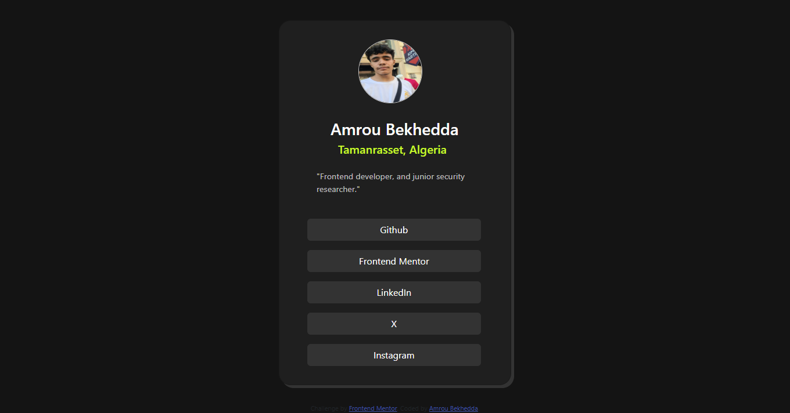

# Frontend Mentor - Social links profile solution

This is a solution to the [Social links profile challenge on Frontend Mentor](https://www.frontendmentor.io/challenges/social-links-profile-UG32l9m6dQ). Frontend Mentor challenges help you improve your coding skills by building realistic projects. 

## Table of contents

- [Overview](#overview)
  - [The challenge](#the-challenge)
  - [Screenshot](#screenshot)
  - [Links](#links)
- [My process](#my-process)
  - [Built with](#built-with)
  - [What I learned](#what-i-learned)
  - [Useful resources](#useful-resources)
- [Author](#author)
- [Acknowledgments](#acknowledgments)

## Overview

### The challenge

Users should be able to:

- See hover and focus states for all interactive elements on the page

### Screenshot



### Links

- Solution URL: [solution URL](https://github.com/Amoru-Bek/social-links)
- Live Site URL: [live site URL](https://amoru-bek.github.io/social-links/)

## My process

### Built with

- Semantic HTML5 markup
- CSS custom properties
- Flexbox
- CSS Grid
- [Bootstrap](https://getbootstrap.com/) - For styles

### What I learned

Building dynamic  web pages that can fit all devices and Deeping my understanding of Css  

Code snippets :

```html
<main>
  <div class="card">
    
    <h3>Amrou Bekhedda</h3>
    <h5>Tamanrasset, Algeria</h5>
    <p>"Frontend developer, and junior security researcher."</p>
    <a class="btn btn-secondary" href="https://github.com/Amoru-Bek" role="button">Github</a>
    <a class="btn btn-secondary" href="https://www.frontendmentor.io/profile/Amoru-Bek" role="button">Frontend Mentor</a>
    <a class="btn btn-secondary" href="https://www.linkedin.com/in/amrou-bekhedda-99b314341/" role="button">LinkedIn</a>
    <a class="btn btn-secondary" href="#" role="button">X</a>
    <a class="btn btn-secondary last-link" href="#" role="button">Instagram</a>
  </div>
</main>
```
```css
img{
  width: auto;
  height: auto;
  margin: 2rem 8rem 0.5rem 8.5rem;
  border-radius: 50%;
  border: 1px solid #ccc;
  max-height: 110px;
  max-width: 110px;

}
img:hover{
  cursor: pointer;
}
```

### Useful resources

- [Free CSS tutorials whit W3schools](https://www.w3schools.com/Css/default.asp) - Which helped me creating the card.
- [Bootstrap Framework](https://getbootstrap.com/) - An amazing Css Framework.

## Author

- Linkedin - [Amrou Bekhedda](https://www.linkedin.com/in/amrou-bekhedda-99b314341/)
- Frontend Mentor - [@Amrou Bekhedda](https://www.frontendmentor.io/profile/Amoru-Bek)
- Github - [@Amoru-Bek](https://github.com/Amoru-Bek)

## Acknowledgments

Thanks [Frontend Mentor](https://www.frontendmentor.io/)

